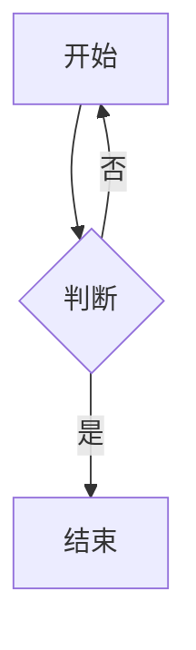

# Markdown 扩展验证样例

[TOC]

## 基础结构

段落、**粗体**、*斜体*、***粗斜体***、~~删除线~~、`行内代码`、==高亮==、H~2~O、x^2^、++插入++。

> 普通引用块。
>
> 第二段引用。

- 无序列表
  - 嵌套一层
    - 嵌套两层
1. 有序列表
2. 第二项
   1. 嵌套有序

- [ ] 未完成任务
- [x] 已完成任务

---

## 表格与链接

| 左对齐 | 居中 | 右对齐 |
| :--- | :---: | ---: |
| A | B | C |
| 中文 | 数值 1 | 1.5 |

自动链接：<https://example.invalid/auto>，普通链接：[示例](https://example.invalid/page)，行内代码链接源：`[不是链接](x)`。

图片（相对路径需要附件目录授权）：

## 代码

```js
const value = "$不是公式$";
console.log(value);
```

```
未知语言的围栏：原样显示，不高亮。
```

   缩进代码块中的 $x$ 不应被当作公式。

## 脚注与定义列表

这里引用一个脚注[^note]，还有第二个[^long]。

[^note]: 脚注内容，包含 `代码` 与[链接](https://example.invalid/footnote)。

[^long]: 较长的脚注内容。
    第二行缩进属于同一脚注。

术语 A
: 定义 A

术语 B
: 定义 B 的第一段
: 定义 B 的第二段

## GitHub Alerts

> [!NOTE]
> 普通提示。

> [!TIP]
> 小技巧。

> [!IMPORTANT]
> 重要信息。

> [!WARNING]
> 警告信息。

> [!CAUTION]
> 危险信息。

## Obsidian 风格 Callout

> [!info] 带标题的信息块
> 内容第一行。
> 内容第二行。

> [!success]- 默认折叠的成功块
> 折叠内容，导出前应自动展开。

> [!unknown-type] 未知类型
> 未知类型按普通引用显示，不报错。

## 受限 HTML

<details>
<summary>折叠的 details</summary>

内部内容，支持 Markdown。

</details>

按键 <kbd>Ctrl</kbd> + <kbd>C</kbd>，高亮 <mark>标记文本</mark>，上标 x<sup>2</sup>，下标 H<sub>2</sub>O。

## 公式

行内 `$E=mc^2$` 与行内 $a^2+b^2=c^2$，以及 \( \frac{1}{2} \) 形式。

$$
\begin{aligned}
a+b &= c \\
x+y &= z
\end{aligned}
$$

$$\ce{2H2 + O2 -> 2H2O}$$

$$\ce{N2 + 3H2 <=>[Fe][\Delta] 2NH3}$$

## 图表与结构



```smiles
CCO 乙醇
c1ccccc1 苯
```

```csv
name,value
甲,1
乙,2
```

```tsv
col1	col2
a	b
```

## Emoji 短代码

:smile: :rocket: :warning: 以及未知短代码 :not_a_real_shortcode:

## TOC 与锚点

上面使用了 `[TOC]` 标记。重复标题见下。

## 重复标题

## 重复标题

## 重复标题
