# 50 个图表

## 图表 1 (error)


## 图表 2 (flowchart-elk)

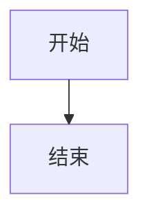

## 图表 3 (mindmap)

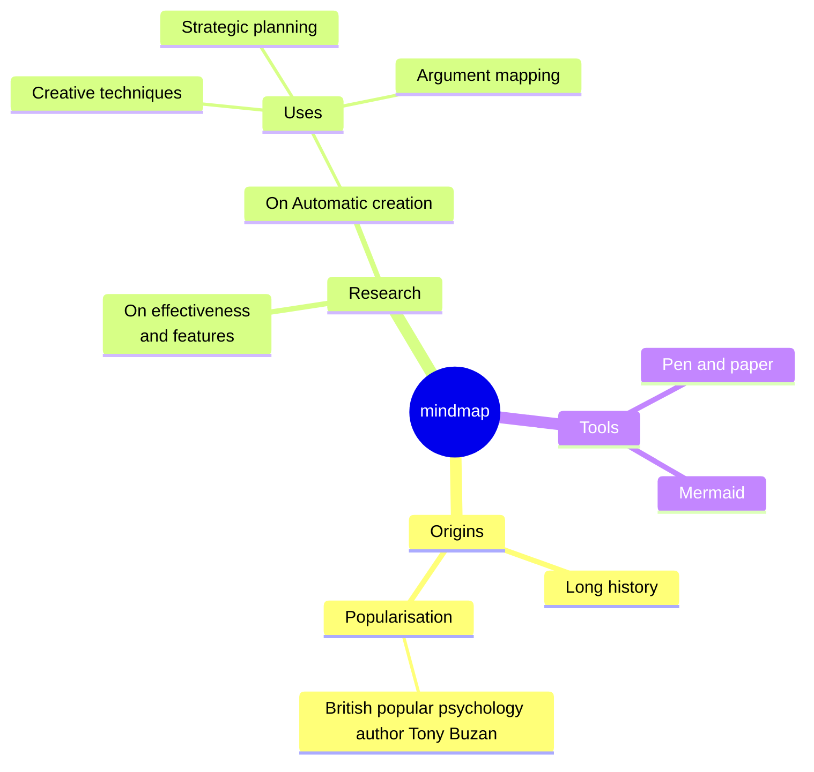

## 图表 4 (architecture)

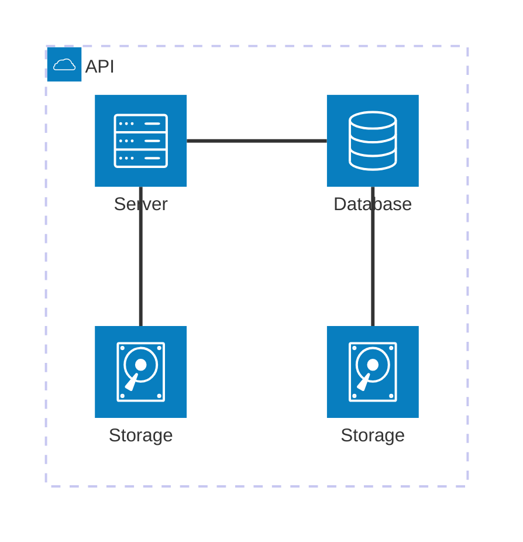

## 图表 5 (agentflow)

```mermaid
agentflow-beta TB
  flow reviewer["Review Agent"]
    changes["Gather changes"]@{ shape: input }
    analyse["Analyse diff"]@{ shape: task }
    lint["run_linter"]@{ shape: tool }
    ok["Clean?"]@{ shape: decision }

    changes --> analyse --> lint --> ok
  end
```

## 图表 6 (c4)

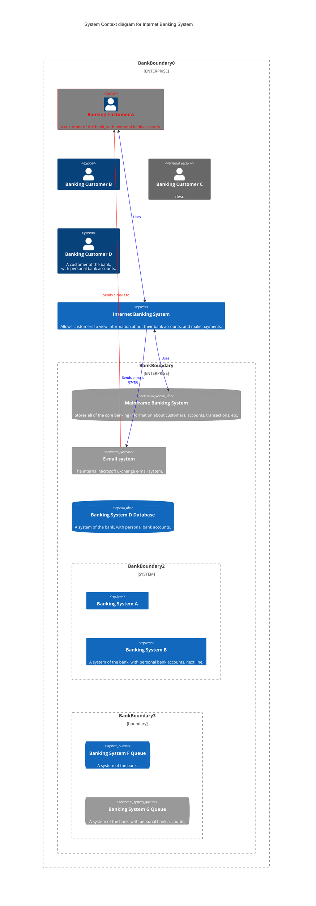

## 图表 7 (kanban)

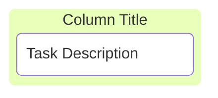

## 图表 8 (classDiagram)

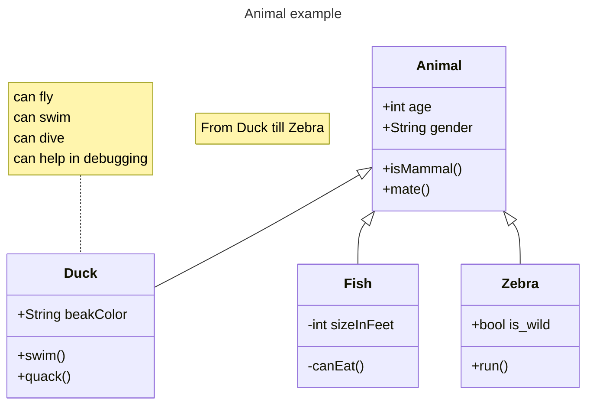

## 图表 9 (er)

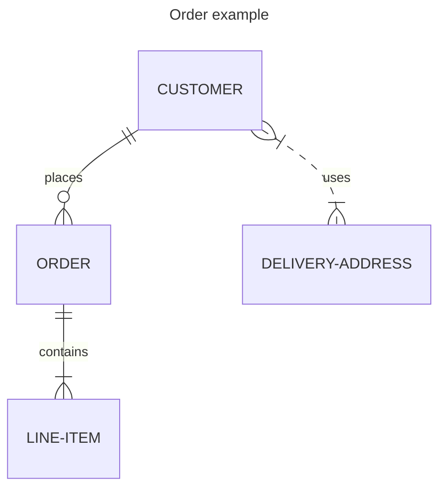

## 图表 10 (gantt)

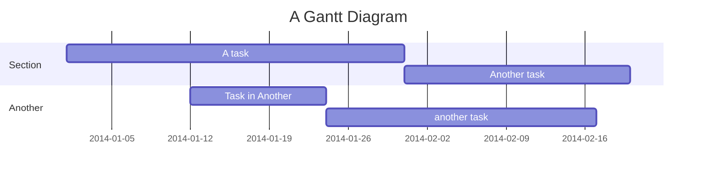

## 图表 11 (info)

```mermaid
info
```

## 图表 12 (pie)

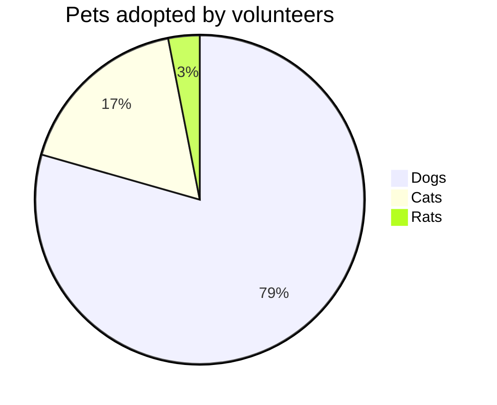

## 图表 13 (requirement)

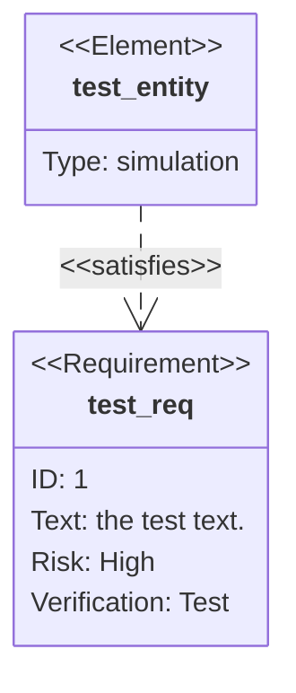

## 图表 14 (sequence)

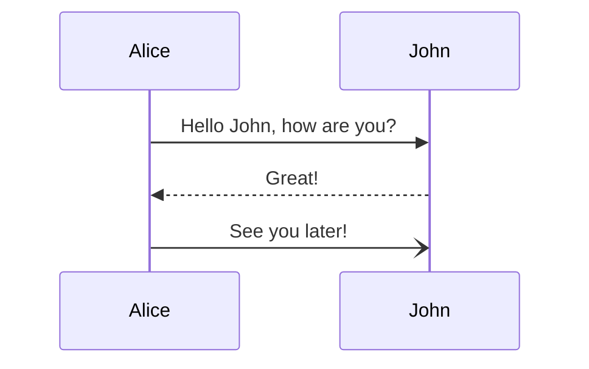

## 图表 15 (swimlane)

```mermaid
swimlane-beta LR
  subgraph Customer
    Browse[Browse catalogue]
    Pay[Pay]
  end
  subgraph Warehouse
    Pick[Pick items]
    Ship[Ship order]
  end
  subgraph Finance
    Invoice[Raise invoice]
  end
  Browse --> Pay
  Pay --> Pick
  Pick --> Ship
  Pay --> Invoice
```

## 图表 16 (flowchart-v2)

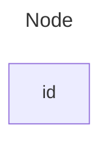

## 图表 17 (timeline)

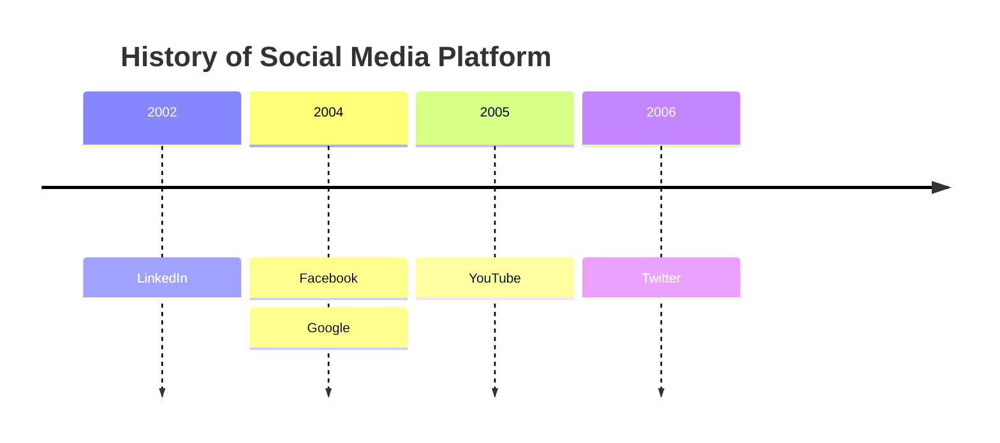

## 图表 18 (gitGraph)

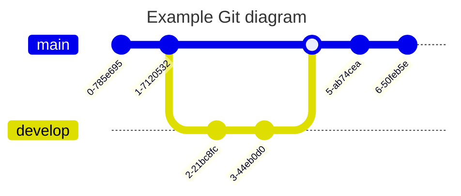

## 图表 19 (stateDiagram)

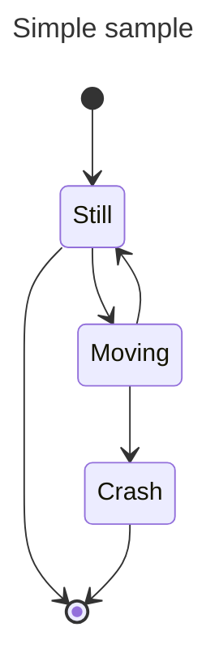

## 图表 20 (journey)

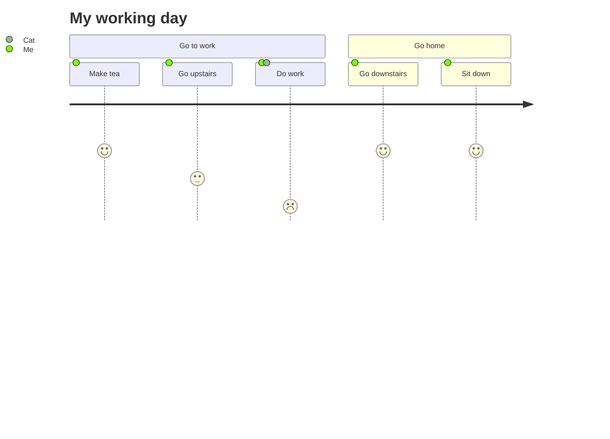

## 图表 21 (quadrantChart)

```mermaid
quadrantChart
    title Reach and engagement of campaigns
    x-axis Low Reach --> High Reach
    y-axis Low Engagement --> High Engagement
    quadrant-1 We should expand
    quadrant-2 Need to promote
    quadrant-3 Re-evaluate
    quadrant-4 May be improved
    Campaign A: [0.3, 0.6]
    Campaign B: [0.45, 0.23]
    Campaign C: [0.57, 0.69]
    Campaign D: [0.78, 0.34]
    Campaign E: [0.40, 0.34]
    Campaign F: [0.35, 0.78]
```

## 图表 22 (sankey)

```mermaid
---
config:
  sankey:
    showValues: false
---
sankey

Agricultural 'waste',Bio-conversion,124.729
Bio-conversion,Liquid,0.597
Bio-conversion,Losses,26.862
Bio-conversion,Solid,280.322
Bio-conversion,Gas,81.144
Biofuel imports,Liquid,35
Biomass imports,Solid,35
Coal imports,Coal,11.606
Coal reserves,Coal,63.965
Coal,Solid,75.571
District heating,Industry,10.639
District heating,Heating and cooling - commercial,22.505
District heating,Heating and cooling - homes,46.184
Electricity grid,Over generation / exports,104.453
Electricity grid,Heating and cooling - homes,113.726
Electricity grid,H2 conversion,27.14
Electricity grid,Industry,342.165
Electricity grid,Road transport,37.797
Electricity grid,Agriculture,4.412
Electricity grid,Heating and cooling - commercial,40.858
Electricity grid,Losses,56.691
Electricity grid,Rail transport,7.863
Electricity grid,Lighting & appliances - commercial,90.008
Electricity grid,Lighting & appliances - homes,93.494
Gas imports,Ngas,40.719
Gas reserves,Ngas,82.233
Gas,Heating and cooling - commercial,0.129
Gas,Losses,1.401
Gas,Thermal generation,151.891
Gas,Agriculture,2.096
Gas,Industry,48.58
Geothermal,Electricity grid,7.013
H2 conversion,H2,20.897
H2 conversion,Losses,6.242
H2,Road transport,20.897
Hydro,Electricity grid,6.995
Liquid,Industry,121.066
Liquid,International shipping,128.69
Liquid,Road transport,135.835
Liquid,Domestic aviation,14.458
Liquid,International aviation,206.267
Liquid,Agriculture,3.64
Liquid,National navigation,33.218
Liquid,Rail transport,4.413
Marine algae,Bio-conversion,4.375
Ngas,Gas,122.952
Nuclear,Thermal generation,839.978
Oil imports,Oil,504.287
Oil reserves,Oil,107.703
Oil,Liquid,611.99
Other waste,Solid,56.587
Other waste,Bio-conversion,77.81
Pumped heat,Heating and cooling - homes,193.026
Pumped heat,Heating and cooling - commercial,70.672
Solar PV,Electricity grid,59.901
Solar Thermal,Heating and cooling - homes,19.263
Solar,Solar Thermal,19.263
Solar,Solar PV,59.901
Solid,Agriculture,0.882
Solid,Thermal generation,400.12
Solid,Industry,46.477
Thermal generation,Electricity grid,525.531
Thermal generation,Losses,787.129
Thermal generation,District heating,79.329
Tidal,Electricity grid,9.452
UK land based bioenergy,Bio-conversion,182.01
Wave,Electricity grid,19.013
Wind,Electricity grid,289.366
```

## 图表 23 (packet)

```mermaid
---
title: "TCP Packet"
---
packet
0-15: "Source Port"
16-31: "Destination Port"
32-63: "Sequence Number"
64-95: "Acknowledgment Number"
96-99: "Data Offset"
100-105: "Reserved"
106: "URG"
107: "ACK"
108: "PSH"
109: "RST"
110: "SYN"
111: "FIN"
112-127: "Window"
128-143: "Checksum"
144-159: "Urgent Pointer"
160-191: "(Options and Padding)"
192-255: "Data (variable length)"
```

## 图表 24 (xychart)

```mermaid
xychart-beta
  title "销量"
  x-axis [一月, 二月, 三月]
  y-axis "数量" 0 --> 100
  bar [30, 60, 90]
  line [40, 70, 80]
```

## 图表 25 (block)

```mermaid
block
columns 1
  db(("DB"))
  blockArrowId6<["&nbsp;&nbsp;&nbsp;"]>(down)
  block:ID
    A
    B["A wide one in the middle"]
    C
  end
  space
  D
  ID --> D
  C --> D
  style B fill:#969,stroke:#333,stroke-width:4px
```

## 图表 26 (eventmodeling)

```mermaid
eventmodeling

tf 01 ui CartUI
tf 02 cmd AddItem
tf 03 evt ItemAdded
```

## 图表 27 (treeView)

```mermaid
treeView-beta
├── src/
│   ├── index.ts
│   └── utils.ts
├── package.json
└── README.md
```

## 图表 28 (radar)

```mermaid
---
title: "Grades"
---
radar-beta
  axis m["Math"], s["Science"], e["English"]
  axis h["History"], g["Geography"], a["Art"]
  curve a["Alice"]{85, 90, 80, 70, 75, 90}
  curve b["Bob"]{70, 75, 85, 80, 90, 85}

  max 100
  min 0
```

## 图表 29 (ishikawa)

```mermaid
ishikawa-beta
    Blurry Photo
    Process
        Out of focus
        Shutter speed too slow
        Protective film not removed
        Beautification filter applied
    User
        Shaky hands
    Equipment
        LENS
            Inappropriate lens
            Damaged lens
            Dirty lens
        SENSOR
            Damaged sensor
            Dirty sensor
    Environment
        Subject moved too quickly
        Too dark
```

## 图表 30 (treemap)

```mermaid
treemap-beta
"Category A"
    "Item A1": 10
    "Item A2": 20
"Category B"
    "Item B1": 15
    "Item B2": 25
```

## 图表 31 (railroad)

```mermaid
railroad-beta
title Expression Grammar

expression = sequence(
    nonterminal("term"),
    zeroOrMore(sequence(
        choice(terminal("+"), terminal("-")),
        nonterminal("term")
    ))
) ;
term = sequence(
    nonterminal("factor"),
    zeroOrMore(sequence(
        choice(terminal("*"), terminal("/")),
        nonterminal("factor")
    ))
) ;
factor = choice(
    nonterminal("number"),
    sequence(terminal("("), nonterminal("expression"), terminal(")"))
) ;
number = oneOrMore(nonterminal("digit")) ;
digit = choice(terminal("0"), terminal("1"), terminal("2"), terminal("3"), terminal("4"), terminal("5"), terminal("6"), terminal("7"), terminal("8"), terminal("9")) ;
```

## 图表 32 (railroadEbnf)

```mermaid
railroad-ebnf-beta
title "Digit Definition"

digit = "0" | "1" | "2" | "3" | "4" | "5" | "6" | "7" | "8" | "9" ;
```

## 图表 33 (railroadAbnf)

```mermaid
railroad-abnf-beta
title "Email Address"

address = local-part "@" domain ;
local-part = 1*( ALPHA / DIGIT / "." / "-" ) ;
domain = label *( "." label ) ;
label = 1*( ALPHA / DIGIT / "-" ) ;
```

## 图表 34 (railroadPeg)

```mermaid
railroad-peg-beta
title "Calculator Grammar"

Expression <- Term (("+" / "-") Term)* ;
Term <- Factor (("*" / "/") Factor)* ;
Factor <- Number / "(" Expression ")" ;
Number <- Digit+ ;
Digit <- "0" / "1" / "2" / "3" / "4" / "5" / "6" / "7" / "8" / "9" ;
```

## 图表 35 (venn)

```mermaid
venn-beta
  title What makes a good feature
  set Desirable
  set Feasible
  set Viable
  union Desirable,Feasible["Buildable"]
  union Feasible,Viable["Sustainable"]
  union Desirable,Viable["Marketable"]
  union Desirable,Feasible,Viable["Ship it"]
```

## 图表 36 (wardley)

```mermaid
wardley-beta
title Tea Shop Value Chain

anchor Business [0.95, 0.63]
component Cup of Tea [0.79, 0.61]
component Tea [0.63, 0.81]
component Hot Water [0.52, 0.80]
component Kettle [0.43, 0.35]
component Power [0.10, 0.70]

Business -> Cup of Tea
Cup of Tea -> Tea
Cup of Tea -> Hot Water
Hot Water -> Kettle
Kettle -> Power

evolve Kettle 0.62
evolve Power 0.89

note "Standardising power allows Kettles to evolve faster" [0.30, 0.49]
```

## 图表 37 (cynefin)

```mermaid
cynefin-beta
  title Incident Response

  complex
    "Investigate root cause"
    "Run chaos experiment"

  complicated
    "Analyze performance data"
    "Expert review needed"

  clear
    "Restart service"
    "Apply known fix"

  chaotic
    "Page on-call immediately"

  confusion
    "Unknown failure mode"
```

## 图表 38 (usecase)

```mermaid
usecase-beta
direction LR
actor Customer("Customer")
systemBoundary "Order system"
  Checkout("Place order")
end
Customer --> Checkout
```

## 图表 39 (error)

```mermaid
error
```

## 图表 40 (flowchart-elk)

```mermaid
flowchart-elk
  A[开始] --> B[结束]
```

## 图表 41 (mindmap)

```mermaid
mindmap
  root((mindmap))
    Origins
      Long history
      ::icon(fa fa-book)
      Popularisation
        British popular psychology author Tony Buzan
    Research
      On effectiveness<br/>and features
      On Automatic creation
        Uses
            Creative techniques
            Strategic planning
            Argument mapping
    Tools
      Pen and paper
      Mermaid
```

## 图表 42 (architecture)

```mermaid
architecture-beta
    group api(cloud)[API]

    service db(database)[Database] in api
    service disk1(disk)[Storage] in api
    service disk2(disk)[Storage] in api
    service server(server)[Server] in api

    db:L -- R:server
    disk1:T -- B:server
    disk2:T -- B:db
```

## 图表 43 (agentflow)

```mermaid
agentflow-beta TB
  flow reviewer["Review Agent"]
    changes["Gather changes"]@{ shape: input }
    analyse["Analyse diff"]@{ shape: task }
    lint["run_linter"]@{ shape: tool }
    ok["Clean?"]@{ shape: decision }

    changes --> analyse --> lint --> ok
  end
```

## 图表 44 (c4)

```mermaid
C4Context
      title System Context diagram for Internet Banking System
      Enterprise_Boundary(b0, "BankBoundary0") {
        Person(customerA, "Banking Customer A", "A customer of the bank, with personal bank accounts.")
        Person(customerB, "Banking Customer B")
        Person_Ext(customerC, "Banking Customer C", "desc")

        Person(customerD, "Banking Customer D", "A customer of the bank, <br/> with personal bank accounts.")

        System(SystemAA, "Internet Banking System", "Allows customers to view information about their bank accounts, and make payments.")

        Enterprise_Boundary(b1, "BankBoundary") {

          SystemDb_Ext(SystemE, "Mainframe Banking System", "Stores all of the core banking information about customers, accounts, transactions, etc.")

          System_Boundary(b2, "BankBoundary2") {
            System(SystemA, "Banking System A")
            System(SystemB, "Banking System B", "A system of the bank, with personal bank accounts. next line.")
          }

          System_Ext(SystemC, "E-mail system", "The internal Microsoft Exchange e-mail system.")
          SystemDb(SystemD, "Banking System D Database", "A system of the bank, with personal bank accounts.")

          Boundary(b3, "BankBoundary3", "boundary") {
            SystemQueue(SystemF, "Banking System F Queue", "A system of the bank.")
            SystemQueue_Ext(SystemG, "Banking System G Queue", "A system of the bank, with personal bank accounts.")
          }
        }
      }

      BiRel(customerA, SystemAA, "Uses")
      BiRel(SystemAA, SystemE, "Uses")
      Rel(SystemAA, SystemC, "Sends e-mails", "SMTP")
      Rel(SystemC, customerA, "Sends e-mails to")

      UpdateElementStyle(customerA, $fontColor="red", $bgColor="grey", $borderColor="red")
      UpdateRelStyle(customerA, SystemAA, $textColor="blue", $lineColor="blue", $offsetX="5")
      UpdateRelStyle(SystemAA, SystemE, $textColor="blue", $lineColor="blue", $offsetY="-10")
      UpdateRelStyle(SystemAA, SystemC, $textColor="blue", $lineColor="blue", $offsetY="-40", $offsetX="-50")
      UpdateRelStyle(SystemC, customerA, $textColor="red", $lineColor="red", $offsetX="-50", $offsetY="20")

      UpdateLayoutConfig($c4ShapeInRow="3", $c4BoundaryInRow="1")
```

## 图表 45 (kanban)

```mermaid
kanban
  column1[Column Title]
    task1[Task Description]
```

## 图表 46 (classDiagram)

```mermaid
---
title: Animal example
---
classDiagram
    note "From Duck till Zebra"
    Animal <|-- Duck
    note for Duck "can fly<br>can swim<br>can dive<br>can help in debugging"
    Animal <|-- Fish
    Animal <|-- Zebra
    Animal : +int age
    Animal : +String gender
    Animal: +isMammal()
    Animal: +mate()
    class Duck{
        +String beakColor
        +swim()
        +quack()
    }
    class Fish{
        -int sizeInFeet
        -canEat()
    }
    class Zebra{
        +bool is_wild
        +run()
    }
```

## 图表 47 (er)

```mermaid
---
title: Order example
---
erDiagram
    CUSTOMER ||--o{ ORDER : places
    ORDER ||--|{ LINE-ITEM : contains
    CUSTOMER }|..|{ DELIVERY-ADDRESS : uses
```

## 图表 48 (gantt)

```mermaid
gantt
    title A Gantt Diagram
    dateFormat YYYY-MM-DD
    section Section
        A task          :a1, 2014-01-01, 30d
        Another task    :after a1, 20d
    section Another
        Task in Another :2014-01-12, 12d
        another task    :24d
```

## 图表 49 (info)

```mermaid
info
```

## 图表 50 (pie)

```mermaid
pie title Pets adopted by volunteers
    "Dogs" : 386
    "Cats" : 85
    "Rats" : 15
```
